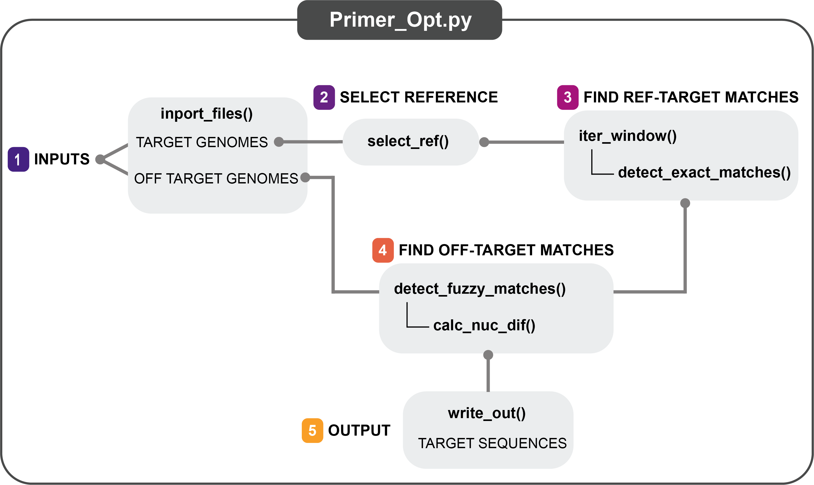

# Primer design
**Purpose:** This directory contains a python script used to detect target sequences among whole genome sequences, or gene sequences and off-target genomes/genes. 

### Requirements:
* **Input data**:
	* Target genome directory containing single fasta sequences for each target sequence
	* Off target genome directory containing single fasta sequences for each off target sequence

* **Software:**
	* python 3+
	* python packages:
		* argparse
		* numpy
		* pandas
		* os
		* glob
		* copy
		* fuzzysearch
		* biopython 

### Downloading data:
* **Virus data:**
	* Virus whole genome sequences can be dowloaded from [NCBI Virus](https://www.ncbi.nlm.nih.gov/labs/virus/vssi/#/)
* **Splitting multi-fasta files:**
	* Primer_opt.py requires a directory containing single fasta sequences (not a single multi-fasta file). If you have a multi-fasta file, split_fasta.sh can be used to split and rename the multi-fasta file (multi_fasta_file.fa) into multiple single fastas in a new directory (fastas).
	* Usage:
	```
	mkdir fastas # place to store new files
	chmod 755 ./scripts/split_fasta.sh # change permissions 
	./scripts/split_fasta.sh multi_fasta_file.fa 
	```

### Detecting primer sequences:
The python script Primer_opt.py detects target sequences that are conserved among species of interest, and not present in off-target genomes. An overview of functions included in Primer_opt.py is shown below:

**Primer_opt.py function outline:** 

<p align="center" width="100%">
	
</p>


**Required inputs:**
* -target path to directory containing target whole genome sequences
* -off path to directory containing off target whole genome sequences 

**Optional inputs:**
* -r index of reference sequence in target sequence directory (default = 0)
* -window target region size (default = 300)
* -slide step to slide window to look for next potential target region (default = 10)
* -max_dif maximum allowed differences between primers and targets (default = 5)
* -out filneame for primer outputs (default = "potential_primers_out.csv")

**Print help message:**
```
 python ./scripts/Primer_opt.py -h 
```

**Example usage:**
```
 python ./scripts/Primer_opt.py -target .data/target_genomes/ -off ./data/off_target_genomes/
```

