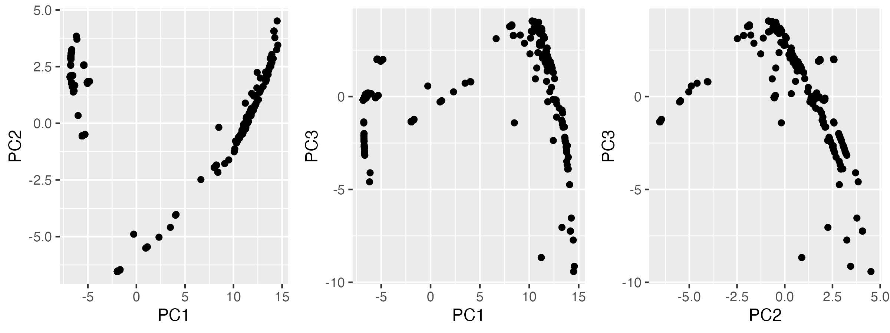

# Primer design
**Purpose:** This directory contains an R script that analyzes population structure of an alignment, and finds positions in the alignment that best distinguish between groups. 

### Requirements:
* **Input data**:
	* Multiple sequence alignment

* **Software:**
	* R
	* R packages (sequence analysis):
		* rhierbaps
		* ape
		* factoextra
		* abdiv
		* adegenet
		* hierfstat
		* phytools
	* R packages (plotting/general purpose):
		* dplyr
		* viridis
		* ggpubr
		* stringr
		* ggtree
		* optparse
	* IQTREE-2 (creating phylogenetic tree)
		* can be downloaded [here](http://www.iqtree.org/)

### Principal components analysis
PCA.R is an R script for transforming SNPs in alignment to boolean vectors, and for perfomring PCA on the transformed vectors. Plots of the first three prinicpal components will be output. For example:
<p align="center" width="100%">
	
</p>

**Required inputs:**
* -a Gene sequence alignment (or whole genome multiple sequence alignment)

**Example usage:**
```
Rscript ./data/Bos_taurus_COI.fasta
```


### Hierarchical clustering:
An R script for running RhierBAPS.

**Create phylogenetic tree**
Use IQtree2 to create phylogenetic tree, for example:
```
iqtree -s data/Bos_taurus_COI.fasta -m GTR+G 
```

**Required inputs:**
* -a Gene sequence alignment (or whole genome multiple sequence alignment)
* -t phylogenetic tree

**Output:**
* Hierarchical groups (level 1, 2, 3) for each sequence 
* Phylogenetic tree colored by group (example below)

<p align="center" width="100%">
	
</p>

**Example usage:**
```
Rscript scripts/run_RhierBAPS.R -a data/Bos_taurus_COI.fasta -t data/Bos_taurus_COI.fasta.treefile
```


